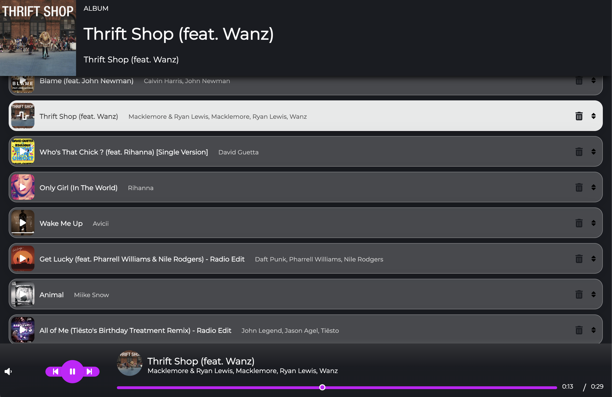

 # 

## [Live Demo](https://music-player-by-zak.netlify.app)

## Available Scripts

In the project directory, you can run:

### `npm start`

Runs the app in the development mode.\
Open [http://localhost:3000](http://localhost:3000) to view it in your browser.

The page will reload when you make changes.\
You may also see any lint errors in the console.

### `npm test`

Launches the test runner in the interactive watch mode.
### `npm run build`

Builds the app for production to the `build` folder.